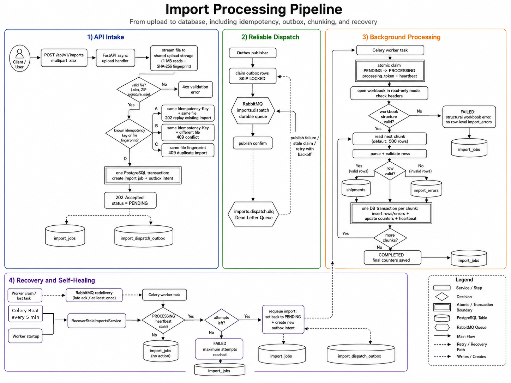

# Shipment Import Service

## Summary

A FastAPI service for importing shipment records from Excel files. A client uploads an `.xlsx` file and receives an import ID immediately. Processing then continues in the background: valid rows become shipments, invalid rows become import errors, and the client can follow the result through query APIs.

The design focuses on the failure cases that matter in a real import pipeline: repeated requests, duplicate shipment codes, large files, broker failures, worker crashes, and partial processing failures.

## Import pipeline at a glance

This PNG is used instead of a Mermaid-only graph so it is visible in local Markdown viewers, GitHub, GitLab, and plain README previews.



### How to read the graph

- **The API request ends at `202 Accepted`.** It does not wait for workbook parsing, row validation, or database inserts for shipments.
- **PostgreSQL is the source of truth.** `import_jobs` records the lifecycle, while the outbox makes the decision to dispatch durable before RabbitMQ is involved.
- **RabbitMQ is only reached through the outbox path.** New uploads and watchdog recovery both write an outbox intent first; the outbox publisher then sends the message to RabbitMQ.
- **The worker commits one chunk at a time.** A completed import may contain both valid shipments and row-level errors.
- **Recovery returns to the normal durable path.** The watchdog requeues by writing to `import_jobs` and `import_dispatch_outbox`; it does not call a worker directly.

## What the service provides

| Area | Behavior |
|---|---|
| Upload | Accepts `.xlsx` files through `POST /api/v1/imports` and returns `202 Accepted` with an import ID. |
| File checks | Verifies file name, ZIP signature, and configured file-size limit before creating the import. |
| Background work | Uses Celery workers and RabbitMQ so the HTTP request stays short. |
| Validation | Checks required fields, formats, allowed shipment statuses, duplicates inside the file, and duplicate shipment codes already in PostgreSQL. |
| Partial success | Saves valid rows and stores invalid rows as errors. A completed import may therefore have `failed_count > 0`. |
| Import status | Returns live counters and terminal failure information through `GET /api/v1/imports/{import_id}`. |
| Import errors | Returns deterministic, paginated row errors through `GET /api/v1/imports/{import_id}/errors`. |
| Shipment search | Lists imported shipments with filters and pagination through `GET /api/v1/shipments`. |
| Recovery | Retries dispatch failures, recovers abandoned outbox claims, and requeues imports left in `PROCESSING` after a worker failure. |

## Assessment requirements covered

The implementation covers the requested upload flow, row validation, persisted valid records, import status, paginated import errors, filtered shipment listing, consistent error responses, Docker, migrations, sample workbooks, and automated tests.

The key assessment questions are also covered below: sync versus async behavior, large-file handling, partial failures, safe duplicate handling, and persisted validation errors.

## Technology stack

- Python 3.12
- FastAPI
- PostgreSQL 16
- SQLAlchemy 2.x with synchronous sessions and Psycopg
- Alembic migrations
- Celery 5.x
- RabbitMQ 3.13 with a durable quorum dispatch queue and a DLQ
- OpenPyXL for `.xlsx` parsing
- Docker Compose
- Pytest and k6

## Quick start with Docker

### Prerequisites

Install Docker Engine and the Docker Compose plugin. No local PostgreSQL or RabbitMQ installation is needed for the normal development flow.

### Start the stack

```bash
cd fastapi_technical_assessment

docker compose up -d --build
docker compose ps
```

The `migrate` service applies Alembic migrations before the API, worker, outbox publisher, and Celery Beat services start.

Check the API:

```bash
curl http://localhost:8000/api/v1/health
```

Useful local URLs:

| Service | URL |
|---|---|
| API health endpoint | `http://localhost:8000/api/v1/health` |
| FastAPI OpenAPI UI | `http://localhost:8000/docs` |
| RabbitMQ Management UI | `http://localhost:15629` |

RabbitMQ local credentials are `import_user` / `import_password`.

### Watch the pipeline

```bash
docker compose logs -f api worker outbox_publisher beat
```

Stop the stack:

```bash
docker compose down
```

`docker compose down` keeps named volumes. Do not add `--volumes` unless you intentionally want to remove local PostgreSQL, RabbitMQ, and uploaded-file state.

## Running without Docker

Docker is the simplest way to run the complete system. For a local Python setup, PostgreSQL and RabbitMQ must already be available.

```bash
cd fastapi_technical_assessment

python3.12 -m venv .venv
source .venv/bin/activate
python -m pip install --upgrade pip
pip install -r requirements.txt

cp .env.example .env
```

Update `DATABASE_URL` and `RABBITMQ_URL` in `.env` for your local services. Then apply migrations and start each process in a separate terminal:

```bash
alembic upgrade head
```

```bash
uvicorn app.main:app --host 0.0.0.0 --port 8000 --workers 2
```

```bash
celery -A app.celery_app:celery_app worker --loglevel=INFO --concurrency=1
```

```bash
python -m app.outbox.services.publish_outbox
```

```bash
celery -A app.celery_app:celery_app beat --loglevel=INFO
```

## Migrations

Docker applies migrations automatically during `docker compose up`. To run them explicitly:

```bash
docker compose run --rm migrate
```

For a local Python environment:

```bash
alembic upgrade head
```

Check the applied revision:

```bash
docker compose exec -T postgres psql \
  -U postgres \
  -d import_service \
  -c "SELECT version_num FROM alembic_version;"
```

## API guide

### 1. Upload an Excel file

```bash
curl -X POST http://localhost:8000/api/v1/imports \
  -H "Idempotency-Key: shipment-demo-001" \
  -F "file=@samples/valid_import.xlsx;type=application/vnd.openxmlformats-officedocument.spreadsheetml.sheet"
```

Example response:

```json
{
  "import_id": "f3a8c84d-1bf7-4d1c-9499-06a923c99852",
  "status": "PENDING",
  "created_at": "2026-06-02T10:30:00Z"
}
```

The initial status is normally `PENDING`. The client should poll the import-status endpoint instead of waiting for file processing inside the upload request.

### 2. Get import status

```bash
IMPORT_ID="f3a8c84d-1bf7-4d1c-9499-06a923c99852"

curl "http://localhost:8000/api/v1/imports/$IMPORT_ID"
```

Example response after processing:

```json
{
  "import_id": "f3a8c84d-1bf7-4d1c-9499-06a923c99852",
  "status": "COMPLETED",
  "total_rows": 100,
  "processed_rows": 100,
  "success_count": 92,
  "failed_count": 8,
  "created_at": "2026-06-02T10:30:00Z",
  "started_at": "2026-06-02T10:30:02Z",
  "finished_at": "2026-06-02T10:31:10Z"
}
```

Possible statuses:

| Status | Meaning |
|---|---|
| `PENDING` | The import is stored and waiting for dispatch or a worker claim. |
| `PROCESSING` | One worker owns the import and updates a heartbeat while it works. |
| `COMPLETED` | Processing finished. Some rows may still be invalid; inspect `failed_count` and the errors endpoint. |
| `FAILED` | A structural or technical failure stopped the import, or retries were exhausted. |

### 3. List import errors

```bash
curl "http://localhost:8000/api/v1/imports/$IMPORT_ID/errors?page=1&page_size=20"
```

Example response:

```json
{
  "items": [
    {
      "row_number": 7,
      "field": "weight_kg",
      "error": "weight_kg must be greater than 0"
    }
  ],
  "pagination": {
    "page": 1,
    "page_size": 20,
    "total_items": 8,
    "total_pages": 1
  }
}
```

The endpoint returns `404 IMPORT_NOT_FOUND` only when the import ID does not exist. An existing import with no row errors returns `200` with an empty `items` list.

### 4. List imported shipments

```bash
curl "http://localhost:8000/api/v1/shipments?status=PENDING&origin_city=Tehran&page=1&page_size=20"
```

Supported filters:

- `status`
- `origin_city`
- `destination_city`
- `customer_name`
- `created_from` in `YYYY-MM-DD` format
- `created_to` in `YYYY-MM-DD` format
- `page` and `page_size`

The default page size is `20`; the current maximum is `100`.

### Error response format

API errors use one consistent shape:

```json
{
  "error": {
    "code": "INVALID_FILE_FORMAT",
    "message": "Uploaded file must be a .xlsx file.",
    "details": null
  }
}
```

Examples of error codes include `INVALID_FILE_FORMAT`, `FILE_TOO_LARGE`, `INVALID_PAGINATION`, `IMPORT_NOT_FOUND`, `IDEMPOTENCY_CONFLICT`, `DUPLICATE_IMPORT`, `DATABASE_ERROR`, and `INTERNAL_ERROR`.

## Duplicate upload and idempotency behavior

The service handles two related but different problems before background processing starts.

| Request situation | Result |
|---|---|
| First upload of a new file | `202 Accepted`; creates one import job and one outbox intent. |
| Same `Idempotency-Key`, same file fingerprint | `202 Accepted`; returns the existing import. No second job or outbox event is created. |
| Same `Idempotency-Key`, different file fingerprint | `409 IDEMPOTENCY_CONFLICT`. |
| Same exact file bytes with no key or a different key | `409 DUPLICATE_IMPORT`; response includes the existing import ID and status. |
| Different file containing shipment codes already stored in the database | `202 Accepted`; row-level errors are recorded later by the worker. |

The file fingerprint is SHA-256. A PostgreSQL transaction-scoped advisory lock is taken on that fingerprint before the duplicate lookup, so concurrent uploads of the same file cannot create two import jobs.

## Excel contract

The service accepts `.xlsx` files only. It checks the file extension and ZIP signature during upload, then validates the workbook structure in the worker.

| Column | Required | Rule |
|---|---:|---|
| `shipment_code` | Yes | Required; unique in the file and globally unique in the database. |
| `customer_name` | Yes | Required; maximum 150 characters. |
| `origin_city` | Yes | Required. |
| `destination_city` | Yes | Required. |
| `weight_kg` | Yes | Required; must be greater than 0. |
| `price` | Yes | Required; must be greater than or equal to 0. |
| `status` | Yes | Required; one of `PENDING`, `IN_TRANSIT`, `DELIVERED`, or `CANCELED`. |
| `delivery_date` | No | Optional; must be a valid date when supplied. |

Sample workbooks are available in `samples/`:

| File | Purpose |
|---|---|
| `valid_import.xlsx` | Small valid upload example. |
| `mixed_import.xlsx` | Mix of valid and invalid rows. |
| `missing_headers_import.xlsx` | Workbook-structure failure example. |
| `duplicate_codes_import.xlsx` | Duplicate shipment-code example. |
| `valid_chunking_1000_rows.xlsx` | Larger sample to show multiple 500-row chunks. |

## Main technical decisions

### Sync or async? A deliberate mixed model

The assessment asks which parts are synchronous, which parts are asynchronous, and why. This project uses both models for different jobs instead of trying to make every layer async.

| Part of the system | Model | Why this model fits |
|---|---|---|
| Upload endpoint and file reads | **Async** FastAPI handler | The API can keep serving other connections while it waits for a client to send file bytes or for local file I/O. The file is streamed in configured byte chunks instead of being read into memory at once. |
| Short create-import database flow | **Synchronous database code in FastAPI's thread pool** | This project uses synchronous SQLAlchemy `Session` and Psycopg. The route calls the service with `run_in_threadpool`, so the synchronous commit does not block the async event loop. |
| Import processing after `202` | **Asynchronous at the system level; synchronous inside a Celery worker** | The request and the work are separated by RabbitMQ. Inside the worker, OpenPyXL parsing, validation, and the database session are synchronous, so a normal synchronous task is simpler and matches the libraries in use. |
| Per-chunk writes | **Synchronous transaction** | A chunk needs one clear transaction boundary for shipments, errors, counters, and heartbeat updates. |
| Watchdog schedule | **Asynchronous background schedule through Celery Beat** | Recovery is periodic system work, not request work. It should continue even when no user is uploading a file. |

This is why the service is not "all async". Async code is useful at the HTTP boundary where the service waits on I/O. The long Excel and database work is deliberately moved out of the request and run synchronously in worker processes, where it does not hold an HTTP connection or block the API event loop.

### Why use the transactional outbox?

Creating an import job and sending a Celery task involve two different systems: PostgreSQL and RabbitMQ. A direct `send_task()` after a database commit leaves a dangerous gap:

- PostgreSQL can commit while RabbitMQ publishing fails, leaving a `PENDING` import that never starts.
- A task can reach a worker before the database transaction commits, so the worker cannot reliably load the import.

The service writes `import_jobs` and `import_dispatch_outbox` in the **same PostgreSQL transaction**. When that transaction commits, the decision to process the file is durable. The outbox publisher later claims the intent, publishes outside the DB transaction, and records the outcome.

The publisher uses `SKIP LOCKED`, claim tokens, confirmed publish, retry delays, and stale-claim recovery. If dispatch retries are exhausted before processing starts, the import is marked `FAILED` with a clear reason.

The watchdog uses the same idea. When it finds an abandoned `PROCESSING` import, it writes a **new outbox intent in the recovery transaction**. It does not bypass PostgreSQL with a direct broker call. Recovery therefore follows the same reliable dispatch path as a new upload.

### Why use a watchdog, and why Celery Beat?

RabbitMQ redelivery is useful, but it cannot prove that a worker completed the business work. A worker can crash after it has claimed an import and changed the status to `PROCESSING`. It can also become stuck after a partial failure.

Each claimed import stores a processing token and heartbeat. The worker refreshes the heartbeat after each committed chunk. The watchdog searches for `PROCESSING` imports whose heartbeat has expired.

Inside a locked transaction, it either:

1. moves the import back to `PENDING` and creates a new outbox intent when attempts remain; or
2. marks the import `FAILED` once the maximum attempt count is reached.

Celery Beat runs this check every `WATCHDOG_INTERVAL_SECONDS` (5 minutes / 300 seconds in the recommended local configuration). It is a good fit because the check is recurring background work, not a request and not a side effect that should live inside every worker task. The same recovery service also runs when a worker becomes ready, so a restart does not have to wait for the next Beat tick.

### What is a DTO here, and why use one?

DTO means **Data Transfer Object**. Here, DTOs are small immutable dataclasses that carry only the data needed between layers.

Examples:

- `ImportCreatedResult` for the upload result
- `ImportStatusReadModel` for `GET /api/v1/imports/{import_id}`
- `ImportErrorReadModel` for the paginated errors endpoint

They keep response contracts explicit and avoid returning SQLAlchemy ORM objects directly. That prevents accidental exposure of internal columns such as file paths, processing tokens, retry state, or ORM relationships. DTOs are not the same as the Pydantic model used to parse an Excel row: Pydantic validates input values; DTOs shape data that has already crossed an application boundary.

### Why use chunking?

The worker reads and processes the workbook in configurable chunks. The default is **500 rows per chunk**.

Chunking is used to:

- keep memory usage bounded instead of collecting the full workbook result;
- keep database transactions short;
- make progress counters and heartbeats durable during a large import;
- limit how much work must be retried after a database problem; and
- commit valid shipments and row errors together for each chunk.

For every chunk, the worker validates rows, writes valid shipments, writes validation errors, updates counters, and refreshes the heartbeat in one transaction. A 1,000-row workbook is still one import job; it simply reaches PostgreSQL through two short transactions with the default configuration.

### Why Celery and RabbitMQ?

The API should not parse a large workbook, validate every row, and make many database writes while an HTTP connection stays open. Celery moves that work to a worker process. RabbitMQ provides the durable hand-off between the outbox publisher and the workers.

The dispatch queue is a durable RabbitMQ quorum queue. The worker uses late acknowledgement, rejects work when a worker is lost, and uses a prefetch multiplier of `1`. These settings reduce the chance of lost work and avoid one worker reserving a large batch while another worker is idle.

If a worker crashes before acknowledging its task, RabbitMQ can redeliver it. The database claim token, global shipment-code constraint, outbox retry rules, startup recovery, and the Beat watchdog make repeated delivery safe. This is an **at-least-once** design: it does not pretend that PostgreSQL and RabbitMQ can share one global transaction. Instead, it makes duplicate delivery and recovery safe.

## Large files, partial failures, and duplicate shipment codes

### What happens with a large file?

- The API streams the upload to disk in configured byte chunks instead of loading the request body into memory at once.
- The API enforces `MAX_UPLOAD_SIZE_BYTES` (50 MB by default).
- The worker opens the workbook in read-only mode and processes rows in 500-row chunks by default.
- The request returns before parsing starts; the client polls the status endpoint.

### What happens if processing fails halfway?

Each chunk commits independently. Earlier committed chunks remain durable. The import also has counters and a heartbeat that show how far processing got.

For retryable database failures, the task is requeued up to `IMPORT_MAX_ATTEMPTS` (3 by default). For a worker crash or expired heartbeat, the watchdog creates a replacement dispatch intent. Reprocessing clears shipments and errors created by the same import before rebuilding the result, so a retry does not leave duplicated output for that import.

A malformed workbook or missing required headers is a structural failure. The import is marked `FAILED`; it does not create misleading row-level validation errors for a workbook that could not be read safely.

### How are duplicate shipment codes handled safely?

The service protects this at several layers:

1. A `DuplicateTracker` detects repeated codes across the whole uploaded file, including across chunk boundaries.
2. The worker asks PostgreSQL for existing shipment codes in batches before inserting each chunk.
3. PostgreSQL has a global unique constraint on `shipments.shipment_code`.
4. If another import wins a race between the lookup and insert, the failed insert is reclassified as a row-level duplicate validation error instead of becoming an unhandled import failure.

The database constraint is the final authority. Application checks improve the error message; the constraint protects data even under concurrency.

### How are validation errors stored and returned?

Each invalid field is stored in `import_errors` with:

- `import_id`
- Excel `row_number`
- failing `field`
- human-readable `error`
- sanitized `raw_data` as JSONB for internal troubleshooting

`GET /api/v1/imports/{import_id}/errors` returns the public fields with deterministic ordering and pagination. Valid rows go to `shipments`; invalid rows do not.

## Configuration

Settings come from environment variables. The Docker stack loads `.env.example` by default. Copy it to `.env` when changing local settings.

| Setting | Default | Purpose |
|---|---:|---|
| `MAX_UPLOAD_SIZE_BYTES` | `52428800` | Maximum accepted upload size, 50 MB. |
| `UPLOAD_READ_CHUNK_SIZE_BYTES` | `1048576` | API upload streaming read size, 1 MB. |
| `PROCESSING_ROW_CHUNK_SIZE` | `500` | Excel rows handled per worker transaction. |
| `IMPORT_MAX_ATTEMPTS` | `3` | Maximum import processing attempts. |
| `PROCESSING_STALE_TIMEOUT_SECONDS` | `300` | Time before a `PROCESSING` import is considered stale. |
| `WATCHDOG_INTERVAL_SECONDS` | `300` | Celery Beat watchdog schedule, 5 minutes. |
| `OUTBOX_BATCH_SIZE` | `100` | Number of due outbox events claimed at once. |
| `OUTBOX_MAX_ATTEMPTS` | `5` | Maximum broker dispatch attempts. |
| `OUTBOX_RETRY_DELAYS_SECONDS` | `2,4,8,16` | Outbox retry delays in seconds. |
| `DEFAULT_PAGE_SIZE` | `20` | Default API page size. |
| `MAX_PAGE_SIZE` | `100` | Maximum accepted API page size. |

## Tests

The test suite uses real PostgreSQL where database constraints, transactions, races, and recovery behavior matter. Some integration tests start their own isolated Docker Compose project and create temporary databases, so Docker must be available before running the full suite.

Activate the Python environment first:

```bash
source .venv/bin/activate
```

### Assessment test command

This command covers the test cases requested in the assessment: valid upload, non-Excel rejection, missing columns, invalid rows, duplicate shipment codes, import status, paginated import errors, filtered shipments, and import-not-found behavior.

```bash
python -m pytest -q \
  tests/integration/api/test_create_import.py \
  tests/integration/api/test_import_status.py \
  tests/integration/api/test_import_errors.py \
  tests/integration/api/test_shipments.py \
  tests/integration/imports/test_partial_success.py \
  tests/integration/imports/test_duplicate_race.py
```

### Run all Pytest tests

```bash
python -m pytest -v
```

### Run Ruff

```bash
python -m ruff check app tests
```

### Run the k6 idempotency load test

The k6 test checks that many concurrent requests using the same idempotency key resolve to one import instead of creating multiple imports.

Install k6 on Ubuntu with Snap:

```bash
sudo snap install k6
k6 version
```

Start the Docker stack, then run the test from the repository root:

```bash
docker compose up -d --build
k6 run tests/load/k6_import_idempotency.js
```

Expected signals:

```text
checks.........................: 100.00%
http_req_failed................: 0.00%
```

The k6 script should use one fresh file fingerprint per run and reuse the same file bytes and idempotency key inside that run. This avoids a later run being rejected by the intentional duplicate-file guard while still testing concurrent idempotency behavior.

> Note: the current project archive must contain the k6 script at `tests/load/k6_import_idempotency.js` before this command is run. k6 is a standalone CLI tool, so it is intentionally not listed as a Python dependency in `requirements.txt`.

## Known limitations and next steps

- File storage is a shared Docker volume for local deployment. A multi-host production deployment should use object storage such as S3-compatible storage and persist an object key instead of a local path.
- The service accepts `.xlsx` only; it does not support `.xls` or CSV.
- The file-fingerprint duplicate check matches exact bytes. A workbook that contains the same rows but has different binary content is treated as a new file; duplicate shipment-code checks then run in the worker.
- There is no authentication, authorization, tenant isolation, or per-user import ownership in this assessment version.
- The system is designed for safe at-least-once processing. It deliberately does not claim global exactly-once delivery across PostgreSQL and RabbitMQ.
- The RabbitMQ Management UI is available for local inspection. It is intended for local development and troubleshooting, not as a production observability solution.

## Project structure

```text
app/
  api/                 FastAPI routes and consistent error handlers
  common/              Shared pagination helpers
  core/                Environment-backed settings and logging
  db/                  SQLAlchemy models and session setup
  imports/             Upload, parsing, validation, import state, and repositories
  outbox/              Reliable dispatch publisher and persistence logic
  shipments/           Shipment query filters and read model
  storage/             Streamed local file storage
  workers/             Celery task, startup recovery, and Beat task
migrations/            Alembic database migrations
samples/               Example XLSX workbooks
tests/                 Unit, integration, runtime, resilience, and architecture tests
```

## Closing note

The central design choice is simple: accept the file quickly, make the decision to process it durable in PostgreSQL, and let background workers process it in safe chunks. The outbox, queue, idempotency rules, database constraints, and watchdog all support that one pipeline so failures are visible, recoverable, and safe to retry.
